# 오승훈 서일훈 SSAFY TRIP Final 관통 PJT

## 프로젝트 구조
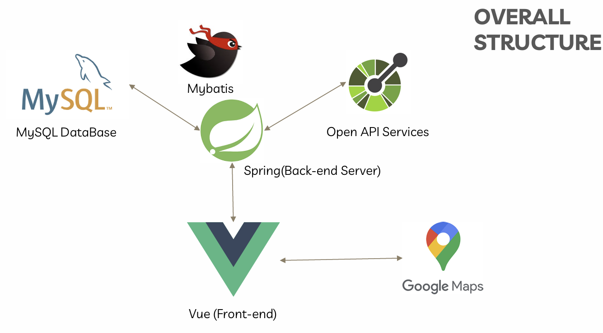

### 기능적 요구사항

| 순번 | 요구사항명                          | 요구사항 상세                                          | 우선순위 | 구현여부 |
| ---- | ----------------------------------- | ------------------------------------------------------ | -------- | -------- |
| F01  | 지역별 관광지 정보 수집             | 한국관광공사 : 지역별 관광지 정보를 얻어와 화면에 표시 | 필수     | o        |
| F02  | 관광지, 숙박, 음식점 조회           | 관광지 정보를 지역별 원하는 컨텐츠 별 조회.            | 필수     | o        |
| F03  | 문화시설, 공연, 여행코스, 쇼핑 조회 | 관광지 정보를 지역별 원하는 컨텐츠 별 조회.            | 필수     | o        |
| F04  | 여행 계획 경로 설정                 | 조회한 관광지를 활용하여 여행 계획, 여행 경로를 저장   | 추가     |   o       |
| F05  | 회원 주도의 hotplace 등록           | 지도와 사진을 활용한 hotplace 등록                     | 추가     |          |
| F06  | 관광지 관련 뉴스 정보 크롤링        | 관광지 정보를 크롤링하여 DB에 저장                     | 심화     |          |
| F07  | 회원 관리                           | 회원가입, 수정, 조회, 탈퇴                             | 필수     | o        |
| F08  | 로그인 관리                         | 로그인 / 로그아웃 / 비밀번호 찾기                      | 필수     | o        |
| F09  | 공지사항                            | 공지사항 등록, 수정, 삭제, 조회                        | 심화     |    o      |
| F10  | 공유게시판                          | 게시판 등록, 수정, 삭제, 조회                          | 심화     |   o       |
| F11  | 관광지 날씨                         | 관광지의 기간별 날씨 조회                              |          |          |
| F12  | 관광지 사진                         | 관광지별 추천 사진 조회                                |          |          |
| F13  | 일출, 일몰시각                      | 관광지별 일출, 일몰시간 조회                           |          |          |
| F14  | 전기자동차 충전소                   | 전기자동차 충전소의 위치, 충전 상태 조회               |          |          |

### 비기능적 요구사항

| 순번 | 요구사항명          | 요구사항 상세                                                 | 우선순위 | 구현여부 |
| ---- | ------------------- | ------------------------------------------------------------- | -------- | -------- |
| NF1  | 공공데이터의 정확성 | 공공데이터 API를 활용함으로 인한 공공데이터의 정확성이 요구됨 |          |          |
| NF2  | 가용성              | 언제나 (어떤 디바이스로든) 서비스 가능해야 함                 |          |          |
| NF3  | 응답성              | 조회에 대한 결과를 빠르게 응답해야 함                         |          |          |
| NF4  | 사용자 편의성       | 웹 사이트에 대한 사전 지식이 없어도 쓰기 편해야 함            |          |          |

### 팀의 아이디어

| 순번 | 요구사항명                                                 | 요구사항 상세                                                                                             | 우선순위 | 구현여부 |
| ---- | ---------------------------------------------------------- | --------------------------------------------------------------------------------------------------------- | -------- | -------- |
| F15  | 축제 조회                                                  | 가까운 날짜의 축제 조회                                                                                   | 추가     |   o       |
| F16  | TSP 알고리즘을 활용한 최적 경로 자동 계산                  | 여행계획 클릭시 홈의 맵에 리다이렉트/거기서 보여주기                                                      | 추가     |    o      |
| F17  | GPT 기반 사용자 맞춤형 여행 플래너 제공                    | 여행계획 페이지에 ai추천버튼 추가                                                                         | 추가     |     o     |
| F18  | 키워드/해시태그 기반 검색 + 지도 실시간 반영               | 홈에서 검색                                                                                               | 추가     |     o     |
| F19  | 대중교통/실시간 도로 상황 반영한 A\* 최적 경로             | 현재 가중치 (거리) / 도로 평균속도 로 시간가중치, openapi로부터 대중교통(지하철) 등의 시간가중치 받아오기 | 추가     |     o     |
| F20  | Rest API 및 서버 상태 확인                     | 관리자 대시보드에 각 API 호출 시간 및 실시간 서버상태 전시                                   | 추가     |      o    |

## 개발자 및 역할

| 이름   | 역할        | git아이디    |
| ------ | ----------- | ------------ |
| 오승훈 | F01, F02, F03, F04, F16, F17, F18, F19  | dhtmdgns0928 |
| 서일훈 | F07, F08, F09, F10, F15, F20  | tjdlfgns1234 |

### class 다이어그램

### usecase 다이어그램

### ERD 다이어그램

## 화면 정의서
### Main 페이지
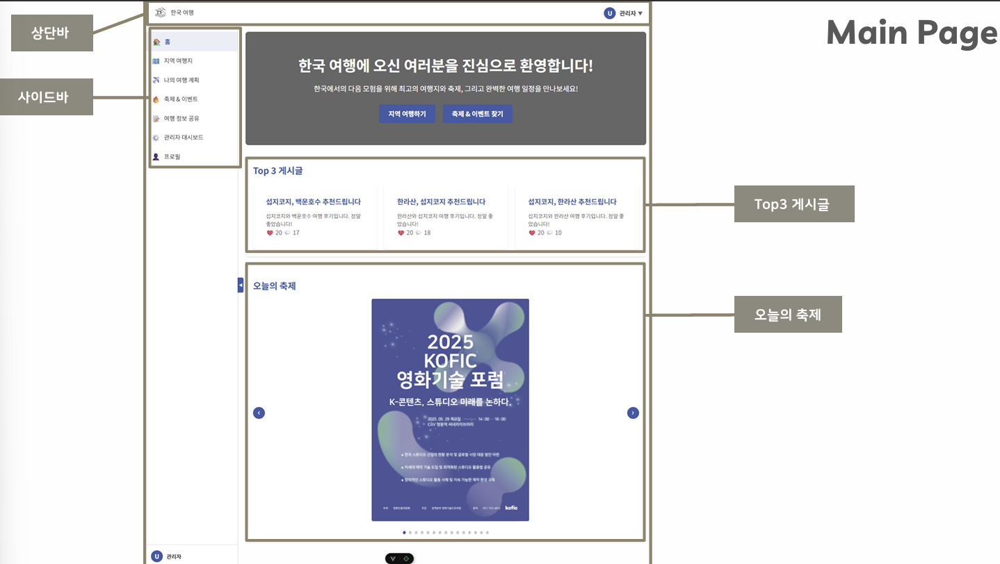 

### Login/signup 페이지
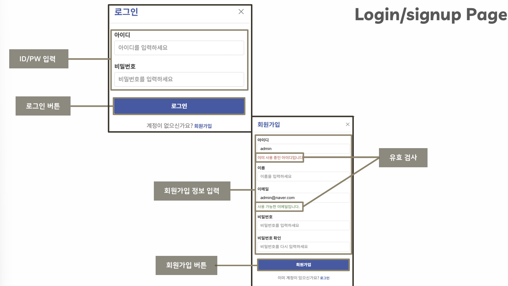

### Profile 페이지
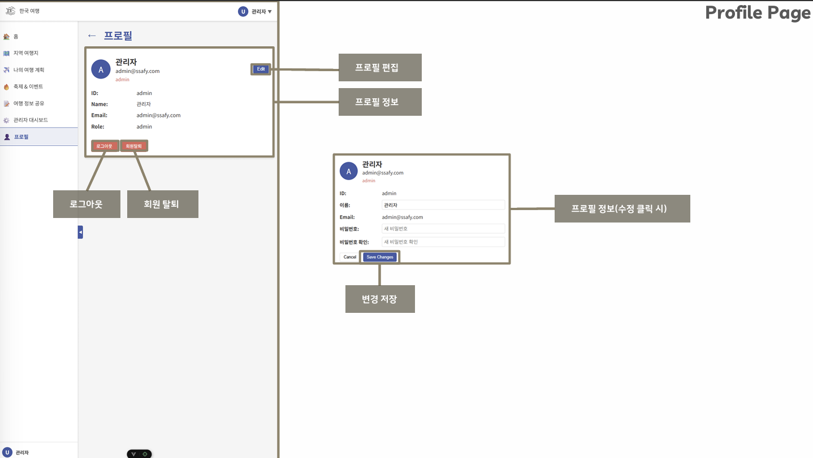

### 지역별 관광지 조회 페이지
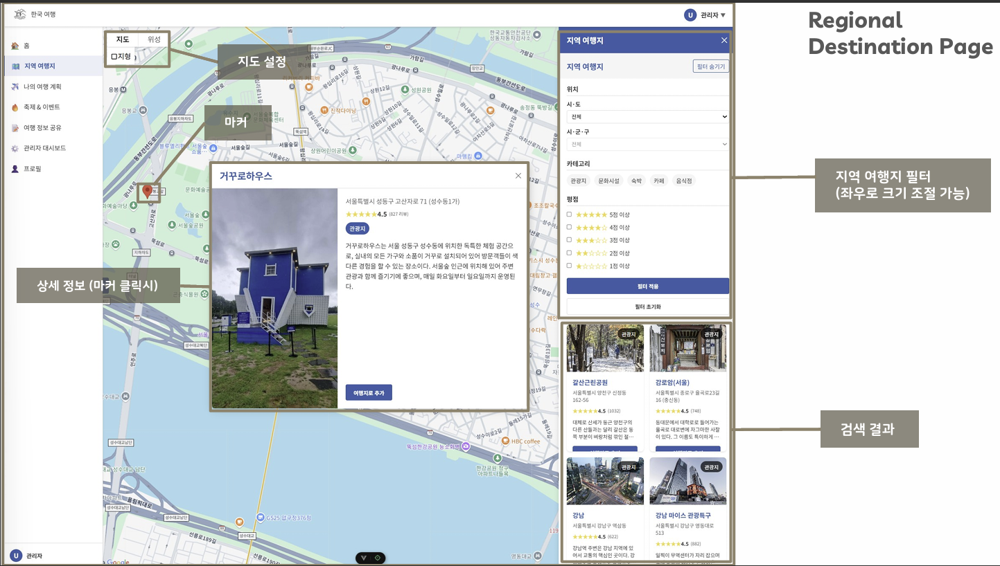
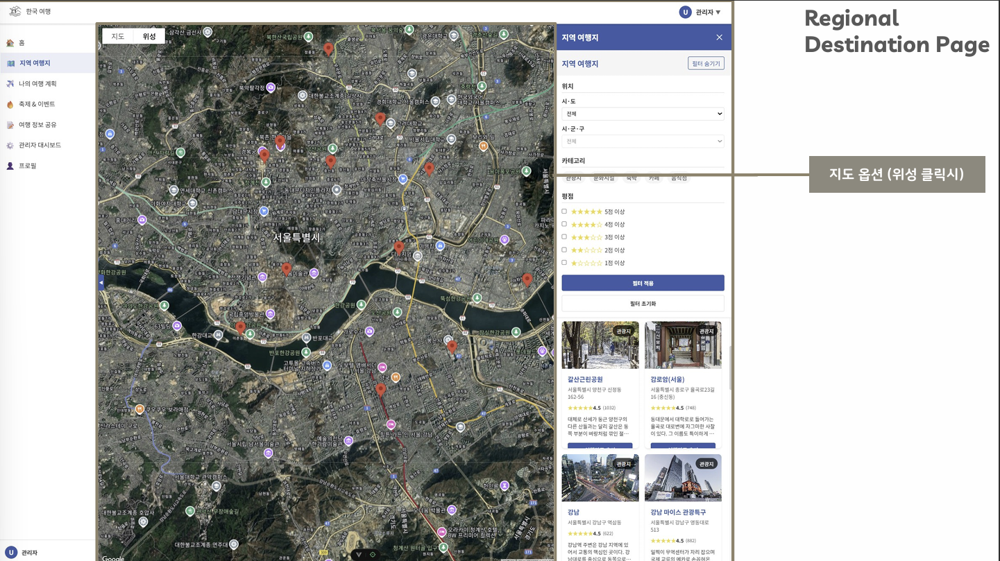

### 여행 계획 조회 및 수정 페이지
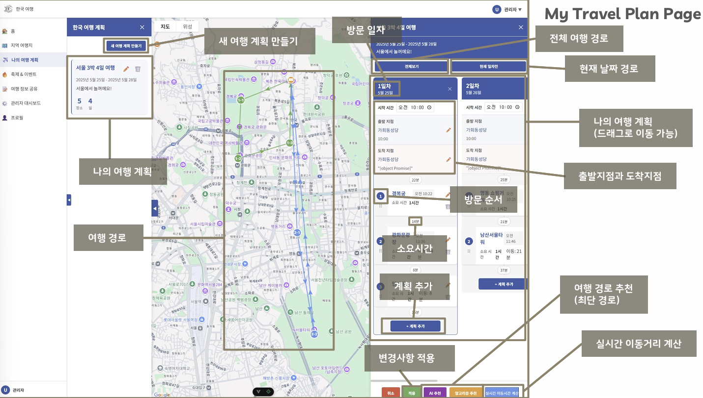
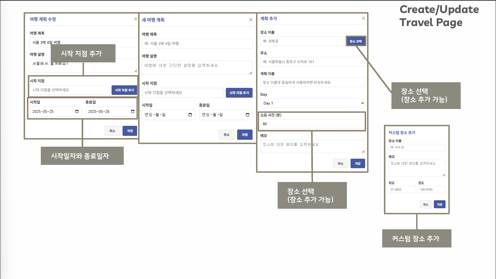

### 축제 & 이벤트 페이지
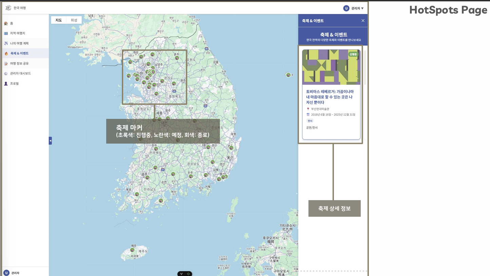
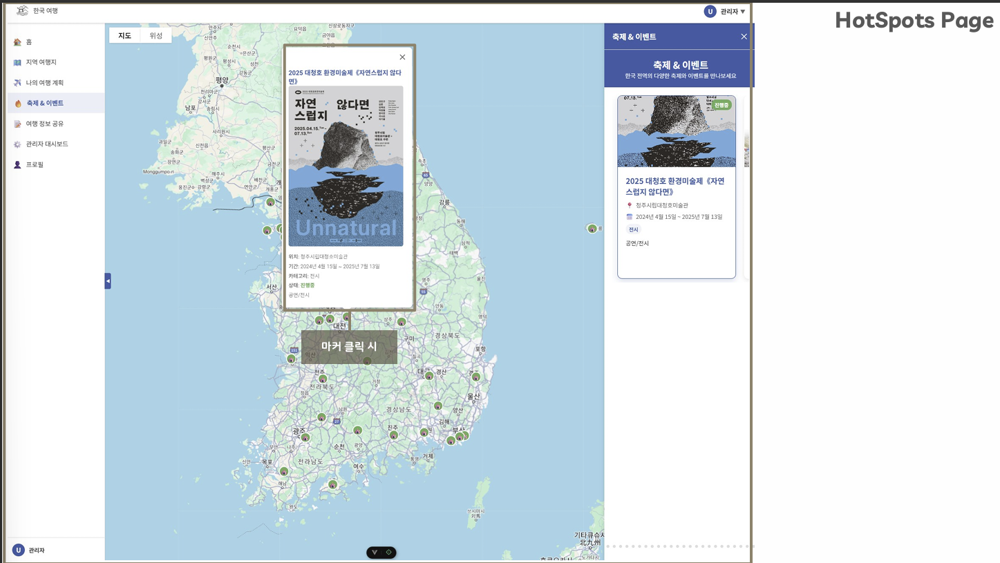
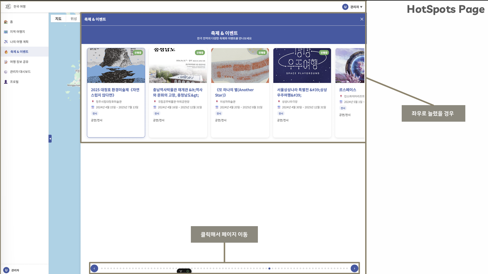

### 관리자 대시보드
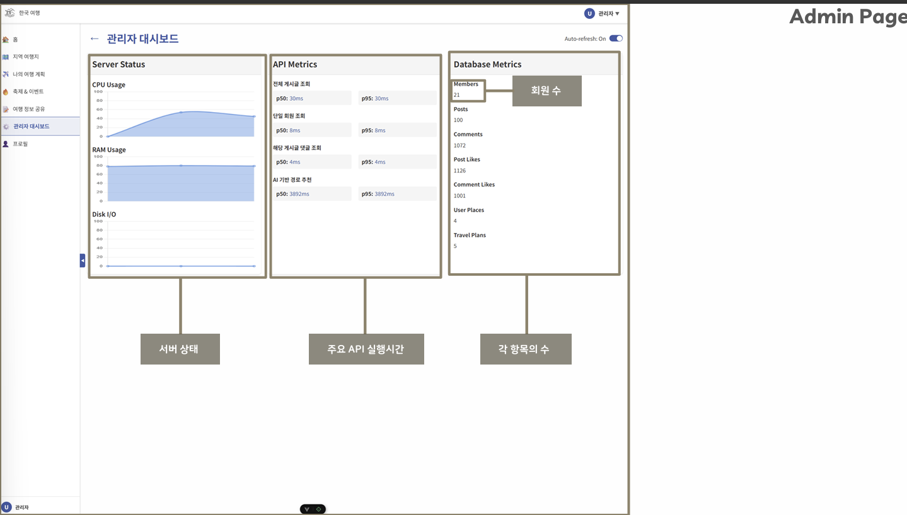

